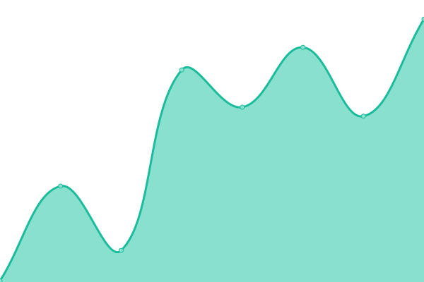

# [📈 Live Status](https://simonmage.github.io/newwave-status-page): <!--live status--> **🟩 All systems operational**

This repository contains the open-source uptime monitor and status page for [simonmage](https://simonmage.github.io/newwave-status-page), powered by [Upptime](https://github.com/upptime/upptime).

With [Upptime](https://upptime.js.org), you can get your own unlimited and free uptime monitor and status page, powered entirely by a GitHub repository. We use [Issues](https://github.com/simonmage/newwave-status-page/issues) as incident reports, [Actions](https://github.com/simonmage/newwave-status-page/actions) as uptime monitors, and [Pages](https://simonmage.github.io/newwave-status-page) for the status page.

<!--start: status pages-->
<!-- This summary is generated by Upptime (https://github.com/upptime/upptime) -->
<!-- Do not edit this manually, your changes will be overwritten -->
<!-- prettier-ignore -->
| URL | Status | History | Response Time | Uptime |
| --- | ------ | ------- | ------------- | ------ |
|  [Drasl Multiplayer Session Service](https://auth.newwave.fun/session) | 🟩 Up | [drasl-multiplayer-session-service.yml](https://github.com/SimonMage/NewWave-Status-Page/commits/HEAD/history/drasl-multiplayer-session-service.yml) | 

 435ms
     
 | 

<a href="https://simonmage.github.io/newwave-status-page/history/drasl-multiplayer-session-service">100.00%</a>
    

|  [Drasl Authserver](https://auth.newwave.fun/auth) | 🟩 Up | [drasl-authserver.yml](https://github.com/SimonMage/NewWave-Status-Page/commits/HEAD/history/drasl-authserver.yml) | 

 118ms
     
 | 

<a href="https://simonmage.github.io/newwave-status-page/history/drasl-authserver">100.00%</a>
    

|  [Mojang Multiplayer Session Service](http://session.minecraft.net) | 🟩 Up | [mojang-multiplayer-session-service.yml](https://github.com/SimonMage/NewWave-Status-Page/commits/HEAD/history/mojang-multiplayer-session-service.yml) | 

 116ms
     
 | 

<a href="https://simonmage.github.io/newwave-status-page/history/mojang-multiplayer-session-service">100.00%</a>
    

|  [Skins](https://auth.newwave.fun) | 🟩 Up | [skins.yml](https://github.com/SimonMage/NewWave-Status-Page/commits/HEAD/history/skins.yml) | 

 120ms
     
 | 

<a href="https://simonmage.github.io/newwave-status-page/history/skins">100.00%</a>
    

|  [Drasl's Public API](https://auth.newwave.fun/auth) | 🟩 Up | [drasl-s-public-api.yml](https://github.com/SimonMage/NewWave-Status-Page/commits/HEAD/history/drasl-s-public-api.yml) | 

 114ms
     
 | 

<a href="https://simonmage.github.io/newwave-status-page/history/drasl-s-public-api">100.00%</a>
    

|  [Main Drasl Auth Website](https://auth.newwave.fun/) | 🟩 Up | [main-drasl-auth-website.yml](https://github.com/SimonMage/NewWave-Status-Page/commits/HEAD/history/main-drasl-auth-website.yml) | 

 2540ms
     
 | 

<a href="https://simonmage.github.io/newwave-status-page/history/main-drasl-auth-website">100.00%</a>
    

|  [drasl API](https://auth.newwave.fun/session/minecraft/profile) | 🟩 Up | [drasl-api.yml](https://github.com/SimonMage/NewWave-Status-Page/commits/HEAD/history/drasl-api.yml) | 

 115ms
     
 | 

<a href="https://simonmage.github.io/newwave-status-page/history/drasl-api">100.00%</a>
    

<!--end: status pages-->

[**Visit our status website →**](https://simonmage.github.io/newwave-status-page)

## 📄 License

- Powered by: [Upptime](https://github.com/upptime/upptime)
- Code: [MIT](./LICENSE) © [Anand Chowdhary](https://anandchowdhary.com), supported by [Pabio](https://pabio.com)
- Data in the `./history` directory: [Open Database License](https://opendatacommons.org/licenses/odbl/1-0/)
